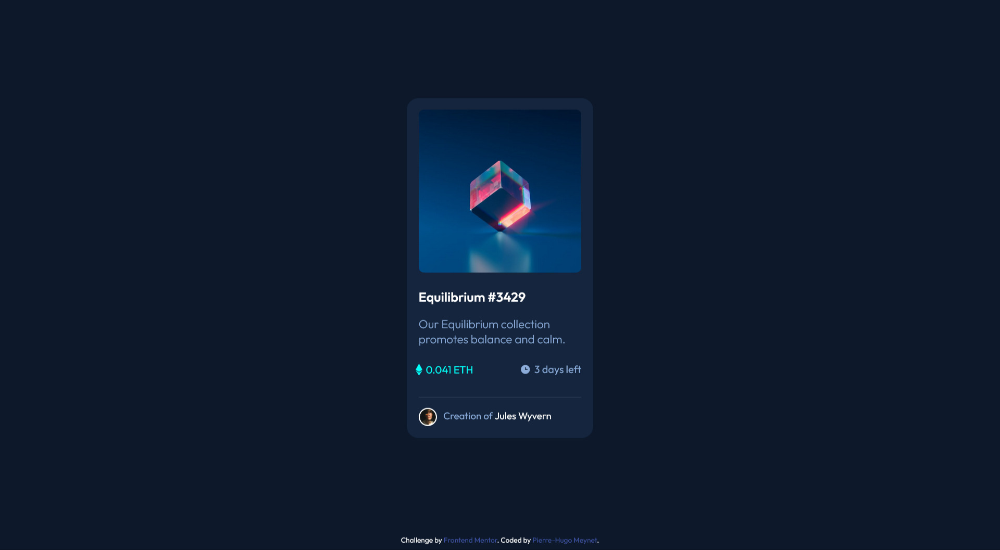

# Frontend Mentor - NFT preview card component solution

This is a solution to the [NFT preview card component challenge on Frontend Mentor](https://www.frontendmentor.io/challenges/nft-preview-card-component-SbdUL_w0U). Frontend Mentor challenges help you improve your coding skills by building realistic projects. 

## Table of contents

  - [The challenge](#the-challenge)
  - [Screenshot](#screenshot)
  - [Useful resources](#useful-resources)
- [Author](#author)

### The challenge

Users should be able to:

- View the optimal layout depending on their device's screen size
- See hover states for interactive elements

### Screenshot

### Useful resources

- [Overlay Icon](https://www.w3schools.com/howto/howto_css_image_overlay_icon.asp) - This helped me to make an overlay hover effect with an icon

## Author

- LinkTree - https://linktr.ee/ekonnect_digital
- Frontend Mentor - [@phmn27](https://www.frontendmentor.io/profile/phmn27)
- Twitter - [@phmeynet](https://www.twitter.com/@phmeynet)

